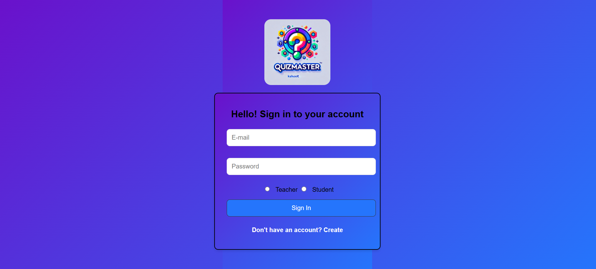
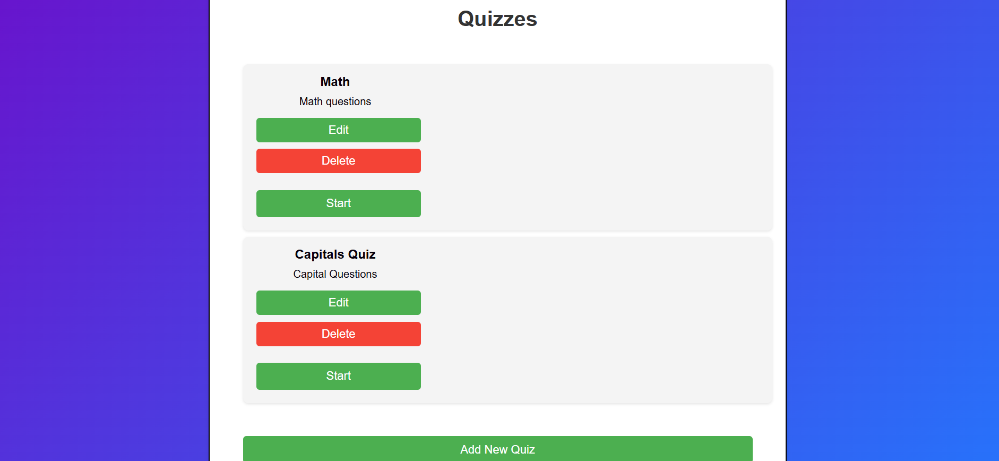
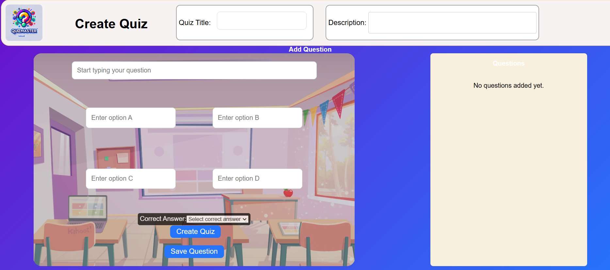
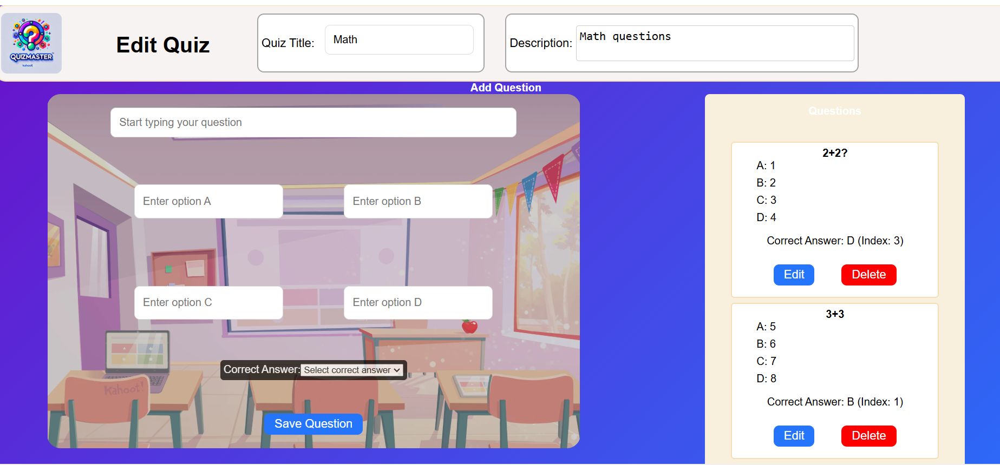
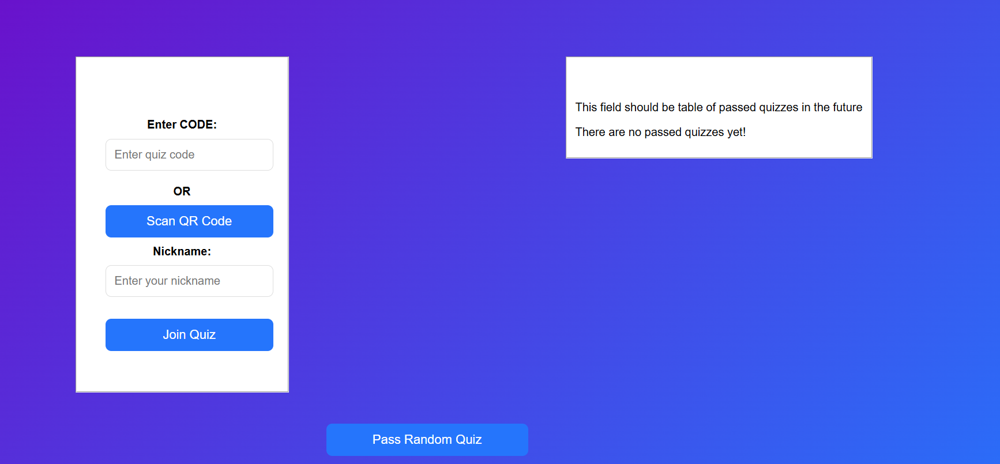

# Kahoot Clone: QuizMaster

## Instructions with the deployed project
- Open [https://kahoot-clonee.onrender.com/](https://kahoot-clonee.onrender.com)
- Create an account as a teacher
  - Login into this account
  - In Quizzes page, feel free to create a new quiz, or update existing quizzes or delete a quiz
  - Click on "Start" button, and it will go to the lobby page.
  - The lobby page show the quiz code and a QRCode (not yet working)
- On another browser, create an account as a student 
  - Login into this account
  - Type the quiz code (qr code not working yet) provided by the teacher lobby and a username
  - Click on "Join Quiz" button
- After, go back to the teacher browser to that the number of Players updated and click on "Start Quiz"
- Teacher page will show the first question and Next Question button (working)
- Student page will NOT work correctly since we are still working on it.

## Screenshots and decriptions
Login page where the user clicks on "Create" to create the teacher or student account

Quizzes page for TEACHER, where he can create a new quiz, update an existing one, delete a quiz, and start a quiz

Create quiz page

Edit quiz page

After TEACHER clicks in "Start" for a quiz

After STUDENT logins, this is the Join Page - student should type the code

After STUDENT clicks in Join Quiz

Teacher view/ Student view

*now we are having a problem with the student quiz (quiz does not start), but teacher quiz start
-Teacher view after clicking on "Start Quiz"

Student view after teacher start quiz

## Instructions to run in the repository
- Clone the repository https://github.com/AndrewTsebriiSigma/Kahoot_Clone
- Open the terminal and type npm run dev for the react application 
- Go to the server folder (cd server), open a terminal and type node server.js
- Open another terminal inside server folder, and type node socket.js
- Open http://localhost:5173/ in your browser
